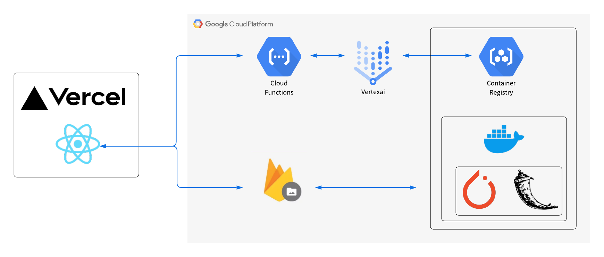

# まどりーだー

## 製品概要
### 背景
- 物件の間取り図には広さ(何帖など)しか書かれていないが、  
物件を探す人は家具が置けるかどうかを判断するために **部屋の寸法(何m)** が知りたい。
- そこでまどりーだーは、間取り図の画像から室内の距離を簡単に確認できるツールを提供。
- さらに実際に内見に行かないとわかりにくい部屋のサイズ感覚も、VRによって把握可能に。

### 製品説明
 1. 間取り図の画像をアップロードするとAIが自動で専有面積のエリアを認識する。
 2. ユーザーは専有面積を入力、もしくは自分で部屋を囲ってその部屋の面積を入力する。
 3. するとユーザーは選択した任意の2点間の距離を確認することができる。
 4. 生成された3DモデルをVR空間で体験し、バーチャル内見できる。
  
プロダクトへのリンク：https://oyster-ashy.vercel.app/  

デモ動画：https://photos.app.goo.gl/GcctJcZF8pinJvMk8  

プレゼン資料：https://www.canva.com/design/DAFRt084ya0/G7m0v7MEFJ5vD3U2Ri_hog/view?utm_content=DAFRt084ya0&utm_campaign=designshare&utm_medium=link&utm_source=publishsharelink

### 特長
 1. 独自開発のセグメンテーションAIモデルを使用
 2. 手動でユーザーが囲ったデータをサーバーに保存することでAIモデルの再学習に利用
 3. 間取り図から実物大の3Dモデルを作成
 4. シンプルで使いやすいUI設計
 
### 解決出来ること
- 気になる物件の部屋の寸法をわざわざ不動産会社に確認して測りにいってもらう手間を省く。
- 実物大3DモデルをVR空間で体験し、バーチャル内見ができる。

### 今後の展望
- AIモデルをAPIとして不動産情報サービスに提供することによって、顧客側は最初から寸法が見れるようにしたい。

### 注力したこと（こだわり等）
- AIの精度（1000枚アノテーション）
- 2Dの間取り画像から３Dモデルの作成
- Google Cloud上にモデルをデプロイすることでスケーラビリティを高めた

## 開発技術
### 活用した技術
#### API・データ
- SUUMOに掲載されている間取り図データ

#### フレームワーク・ライブラリ・モジュール
- React, Mantine, Vercel
- Pytorch, Flask, Docker
- Cloud Functions, Vertex AI, Container Registry, Firebase
  

#### デバイス
- Meta Quest2

### 独自技術
#### ハッカソンで開発した独自機能・技術
- 間取り図中の専有面積部分のsegmentationモデル: https://github.com/jphacks/B_2214/tree/master/machine_learning

#### 製品に取り入れた研究内容（データ・ソフトウェアなど）（※アカデミック部門の場合のみ提出必須）
- 壁を認識するAIモデルに関する論文: https://arxiv.org/abs/1908.11025
